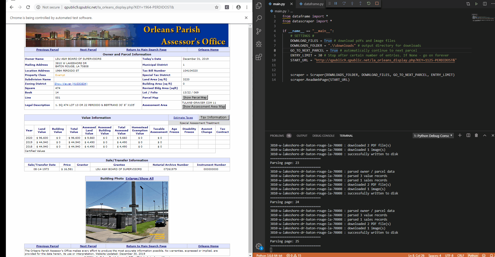

# NoLA-Scraper
A web scraper for New Orleans Parish Assessor's office: http://qpublic9.qpublic.net/la_orleans_display.php?KEY=1125-PERDIDOST&

## Setup
NoLA-Scraper runs on Python 3. It doesn't use any exotic libraries, except for selenium. Here you can find installation instructions:
https://selenium-python.readthedocs.io/installation.html
